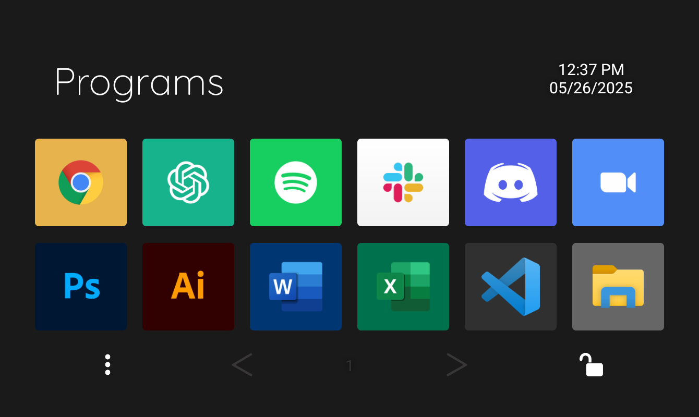
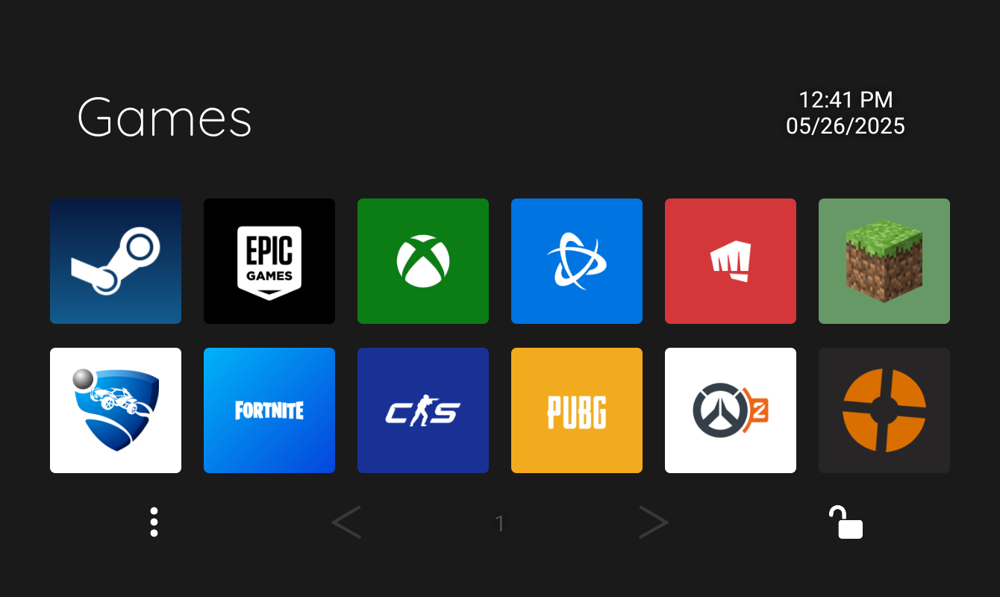
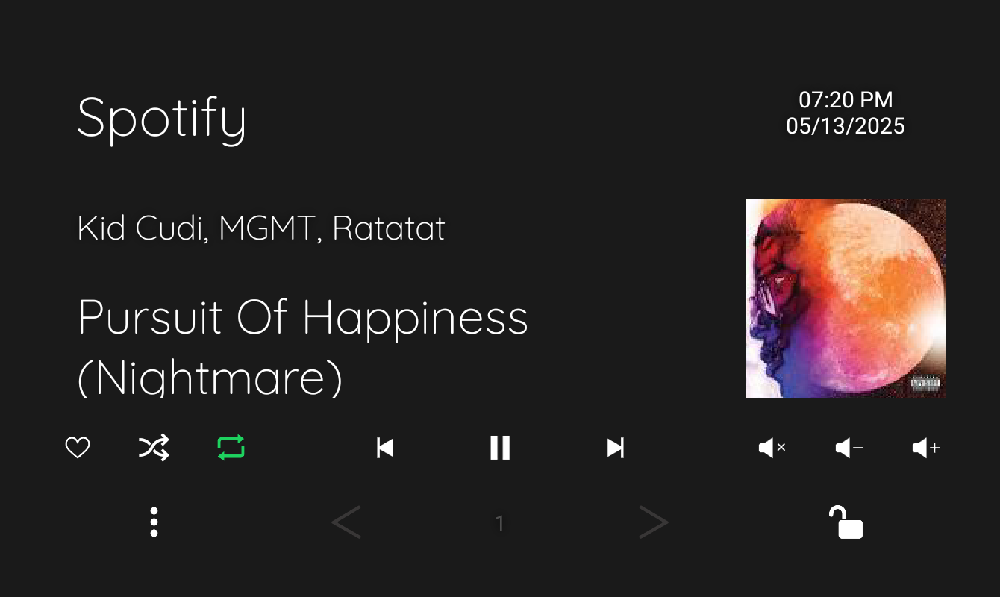

# 📦 GBE Deck – Touch Portal Macro Layout

A highly modular, dark-mode-optimized Touch Portal setup built for productivity, creativity, dev tools, and gaming. Designed to be copied, extended, or entirely remixed.

---

# 🚀 Getting Started

1. **Import All Pages**

   - Select all pages from to the [Live Tool](https://gabriel-velez.github.io/GBE-Deck/) and import them into TouchPortal

2. **Customize to Your Setup**

   - Open any of the `Button List` pages (1–4) to explore categorized layouts:
     - Apps, Games, Web Tools, Creative Software
   - Use these lists to copy and paste buttons into your own custom pages or build custom buttons as needed.

3. **Link your buttons**
   - Replace each button’s action with your installed app’s executable or relevant script.

---

# 🎛️ GBE Deck Page Selector

The GBE Deck site lets you visually choose which pages to include in your custom Touch Portal bundle. Just click, bundle, and go—your personalized setup is generated automatically.

🌐 [Live Tool](https://gabriel-velez.github.io/GBE-Deck/)

---

# 🗂 How It Works

- Each page folder has:

  - `Pages.tpz2` – your actual Touch Portal pages 🔒 locked and 🔓 unlocked

  - `Meta.json` – with `name`, `version`, `author`, `description`, `dependencies (optional)`, `screenshot (single or array)`

  - `Screenshot.png` – or more screenshots for carousel previews

  - Optional: `Icons/` for custom button icons

- The `generate-pages.js` script auto-scans everything and produces a clean `pages.json`.

- The site uses this file to dynamically show all pages + metadata.

---

# 📱 Custom Pages Overview

- **Programs** - Default page that opens when there isn't a designated page.

  - Access all of your favorite Programs at a touch

- **Web Browser** - Opens with Google Chrome. Manage tabs and access quick links:

  - New Tab New Window, Back, Refresh, Incognito Mode, and Close Tab controls.

  - Quick launch shortcuts for YouTube, YouTube Music, Netflix, Reddit, Amazon, and Twitch.

- **YouTube & YouTube Music** – Opens with the respective web apps or browser tab with a interface for playback control:

  - Play/pause, skip forward/backward, rewind 10s, fast-forward 10s, volume up/down, and mute toggle.

- **Coding Tools** – Opens with VS Code. Access a wide range of snippet pages for each major language:

  - **HTML** – Tags for structure (div, class, headings, paragraphs, anchor tags, buttons, scripts, and boilerplate).

  - **CSS** – Property snippets for layout (Flexbox, Grid), spacing (margin, padding), styling (color, background), and positioning (z-index, display, position).

  - **JavaScript** – Two full pages covering declarations, loops, conditionals, class methods, console logs, and flow control blocks (if, else, for, while, etc.).

  - **Python** – Quick-insert for print, variables, functions, loops, if/else, imports, and common statements like return, input(), and dictionary usage.

  - **Regex** – Prebuilt patterns for digits, word characters, whitespace, boundaries, groups, and special lookahead/lookbehind structures.

  - **SQL** – Query snippets including SELECT, INSERT, UPDATE, DELETE, WHERE, JOIN, ORDER BY, and table creation/modification.

  - **GIT** – Essential commands: commit, push, pull, status, branch creation, checkout, clone, and stash.

  - **Terminal** – Common shell commands: list files, change directory, make/remove folders, clear terminal, print path, and run scripts.

  - **Mark Down** – Headers, formatting (bold, italic), links, images, inline/code blocks, and smart buttons for dynamic numbered lists and growing tables.

  - Easily navigate between languages and back to the Coding Languages menu at any time.

- **Discord** – Opens with Discord. Uses a plugin to handle mute, deafen, and hanging up.

  - Mute and deafen states are updated in realtime and sync between discord and the app

- **Spotify** – Opens with Spotify. Uses a plugin to auto-fill album art, song title, artist name, and control everything:

  - Play/pause, skip, rewind, volume, mute/unmute, heart toggle, shuffle, and repeat modes.

- **Adobe Tools** – Opens with Photoshop or Illustrator. Switch between Photoshop tools, Photoshop actions, and Illustrator tools for quick-access workflows.

- **Zoom** – Opens with Zoom. Offers meeting controls for mute, camera toggle, chat view, audience view, hang up, and share screen.

- **Games** – Opens with Steam. Displays common game launchers and favorite game shortcuts.

  - Access your games quickly by touching the tiltle in the _Programs_ page.

- **File Explorer** - Opened manually. Quick navigation for file management:

  - Adds functions as buttons like: New Folder, New Window, Rename, Preview pane, and Properties

  - Shortcuts to PC, Downloads, Documents, and Drives (C:, D:, E:)

- **Quick Controls** - Allows you to access essential settings quiclky

  - Can be accessed on any page by clicking the time and date on the top right

  - Sliders for both Input and Output Audio volume

  - Shortcuts to settings, wifi settings, bluetooth settings, display settings, taskmanager, volume mixer, caluclator, timer, and snipping tool

- **Main menu** - Serves as a hub connecting all pages together

  - Can be accessed on any page by clicking the three vertical dots on the bottom left

---

# 📸 Screenshots:

<table>
  <tr>
    <td align="center">
       
      <strong>Programs</strong>
    </td>
    <td align="center">
       
      <strong>Web Browser</strong>
    </td>
  </tr>
  <tr>
    <td align="center">
       
      <strong>Discord</strong>
    </td>
    <td align="center">
       
      <strong>File Explorer</strong>
    </td>
  </tr>
  <tr>
    <td align="center">
       
      <strong>Games</strong>
    </td>
    <td align="center">
       
      <strong>Quick Controls</strong>
    </td>
  </tr>
  <tr>
    <td align="center">
       
      <strong>Spotify</strong>
    </td>
    <td align="center">
       
      <strong>YouTube</strong>
    </td>
  </tr>
</table>

---

# 🧩 Button List Overview

The `Button List` pages are designed as modular, copy-paste-ready layouts containing popular apps, creative tools, games, and web services.

Each button list acts as a "template row" — so users can easily:

- Grab what they need without hunting down icons
- Mix and match categories
- Drag & drop common launchers and platforms into their own workspace

All buttons are cleanly aligned and color-coordinated to reduce friction for new users.

### Button List 1 – Essentials & Dev

Chrome, Firefox, Arc, Brave File Explorer, Terminal, VS Code, Unity, DaVinci Resolve, Blender, Discord, Spotify, ChatGPT, Touch Portal, Microsoft Office apps, OBS

### Button List 2 – Creative Tools

Photoshop, Illustrator, XD, InDesign, FL Studio, Ableton, DaVinci, Blender, Figma, Postman, Docker, Notion, Trello, Logitech, SteelSeries

### Button List 3 – Websites

YouTube, Netflix, Twitch, Gmail, Google Docs Sheets and Slides, GitHub, LinkedIn, Hulu, Disney Plus, Reddit, CruncyRoll, X and Twitter, Amazon, Twitch, Canva, Parmount Plus, Facebook, Github

### Button List 4 – Games & Launchers

**Launchers**: Steam, Epic Games, Xbox, Battle.net, Riot

**Games**: Minecraft, Rocket League, Fortnite, CS, PUBG, Overwatch 2, Valorant, League of Legends, Roblox, Team Fortress 2, Elden Ring, Hades I & II, Beat Saber, Apex Legends, Genshin Impact

<table>
  <tr>
    <td align="center">
       
      <strong>Button List 1</strong>
    </td>
    <td align="center">
       
      <strong>Button List 2</strong>
    </td>
  </tr>
  <tr>
    <td align="center">
       
      <strong>Button List 3</strong>
    </td>
    <td align="center">
       
      <strong>Button List 4</strong>
    </td>
  </tr>

</table>

---

# 🔄 Pagination & Page Hierarchy

### Parent & Child Page Logic

- **Parent Pages**: Hubs like `Programs`, `Creative`, `Games`
- **Child Pages**: Standalone pages that return to parent via **← arrow** in top-left corner
- Every page has lock/unlock & ⋮ menu buttons in consistent positions

### Pagination Rules (Multi-Page Layouts)

- **First Page**: `[ 1 >` — inactive left, active right
- **Middle Page**: `< # >` — active both sides
- **Last Page**: `< # ]` — active left, inactive right
- **Single Page**: `[ 1 ]` — no arrows, standalone

---

## Navigation & Lock Logic:

- **Automatic page switching** takes you to the correct page when its corresponding window is active.

- Tap the page title to return to the **Default Page**.

- Lock 🔒 / Unlock 🔓 buttons toggle whether the tablet stays on a page.

- Arrows (`<`, `>`) move between multi-page sections.

---

| Element                 | Behavior                                  |
| ----------------------- | ----------------------------------------- |
| **← Arrow**             | Return to parent page                     |
| **⋮ Menu**              | Opens global Main Menu                    |
| **Page Title Tap**      | Returns to default Programs page          |
| **< / > Arrows**        | Navigate between linked pages in a series |
| **🔒 Lock / 🔓 Unlock** | Toggle automatic page navigation          |

---

# 🔧 Requirements

- Touch Portal (v3.1+ recommended)
- Windows 10/11 (auto-page switching only works on Windows)
- [Spotify Plugin](https://www.christophecvb.com/touch-portal/plugins/spotify)
- [Discord Plugin](https://github.com/spdermn02/TouchPortal_Discord_Plugin)

---
